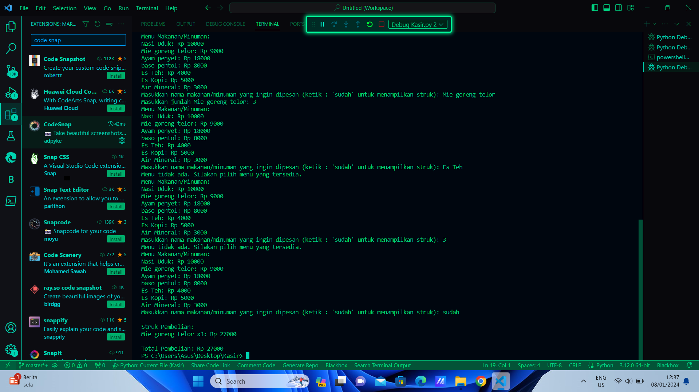

# ProjectUAS

Nama:Fajar Julianwar Muslimin  
NIM :312310672  
KELAS : TI.23.A.6  
DOSEN PENGAMPU: AGUNG NUGROHO S.KOM.,M.KOM. 

Berikut adalah tampilan source code untuk menampilkan menu pada mesin kasir dan menampilkan beberapa menu 

## KODE PROGRAM KASIR 

Ini adalah output jika kode di atas di jalan kan 

## HASIL KODE PROGRAM 

menu = { 'Nasi bakar': 20000, 'Mie rebus telor': 12000, 'Ayam bakar': 20000, 'baso aci' : 13000, 'Es Teh': 5000, 'Es Jeruk': 10000, 'Air Mineral': 5000 }

def tampilkan_menu(): print("Menu Makanan/Minuman:") for item, harga in menu.items(): print(f"{item}: Rp {harga}")

def hitung_total(harga, jumlah): return harga * jumlah

if name == "main": # Your code here # This block will be executed when the script is run directly

Penjelasan:

Kelas MesinKasir: Merepresentasikan mesin kasir dengan atribut database barang dan daftar transaksi.
Metode tambah_barang: Menambahkan barang baru ke dalam database.
Metode tampilkan_daftar_barang: Menampilkan daftar barang dari database.
Metode proses_transaksi: Memproses transaksi, mengurangi stok, dan menambahkannya ke dalam daftar transaksi.
Contoh Penggunaan: Membuat objek MesinKasir, menambahkan barang, menampilkan daftar barang, dan melakukan transaksi.
